# Sprite files (on disk)

Open this file in Cursor and use the **Markdown preview** (not the HTML file). Images sit in this same folder.

## Tileable wraps

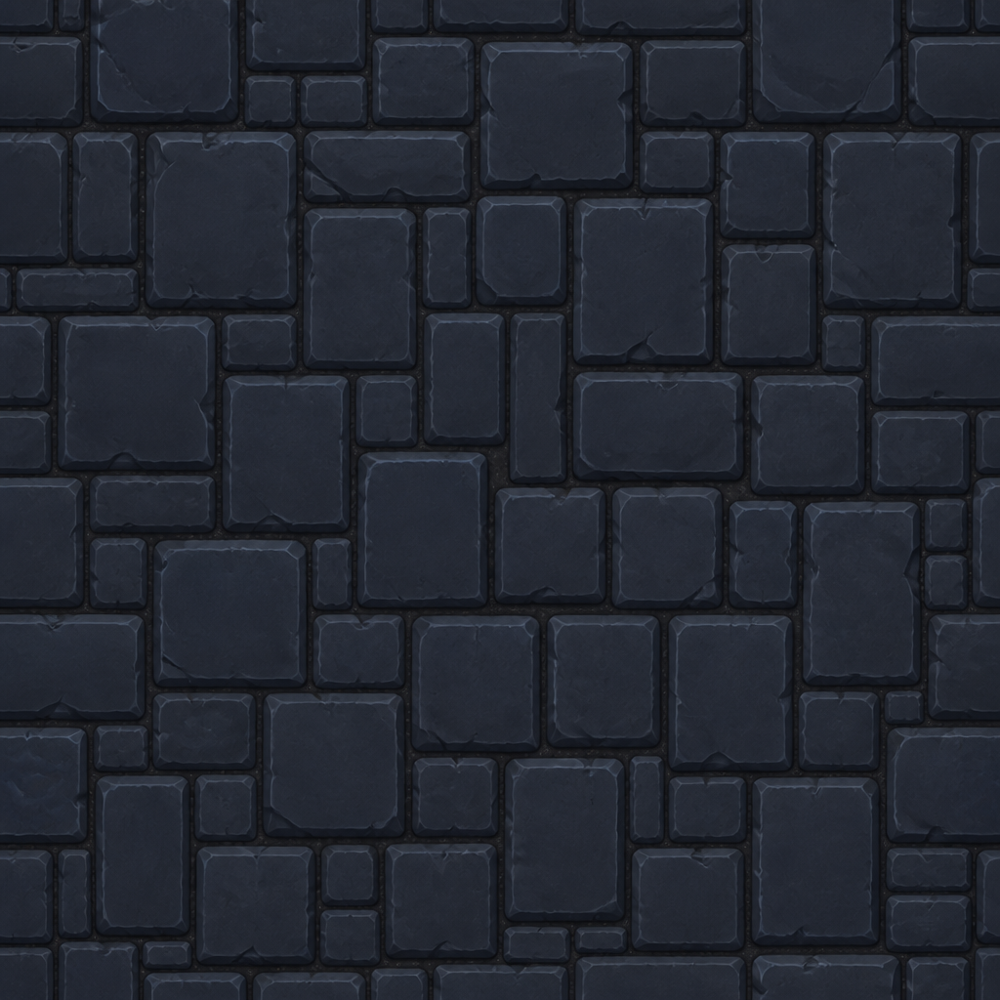

`wrap_rock.png`

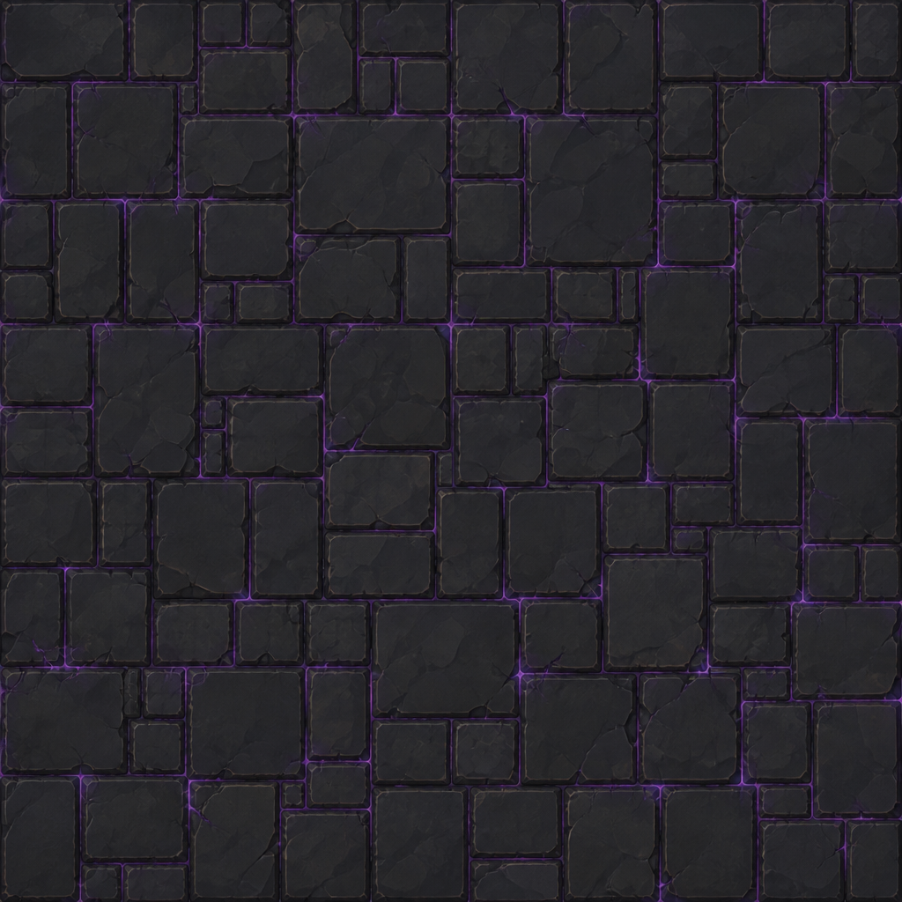

`wrap_floor.png`

## Tiles (each is a full painted square, not a cutout)

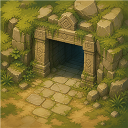

`tile_entrance.png`

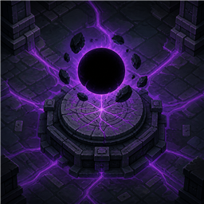

`tile_core.png`

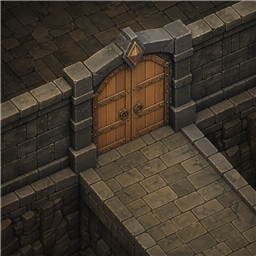

`tile_door.png`

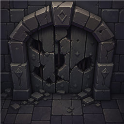

`tile_door_damaged.png`

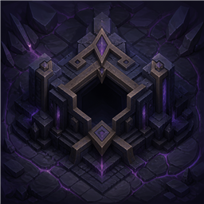

`tile_vault.png`

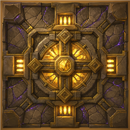

`tile_vault_full.png`

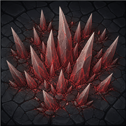

`tile_spike.png`

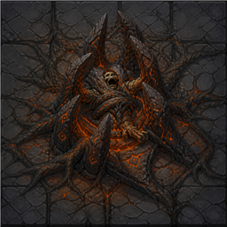

`tile_snare.png`

## Heroes

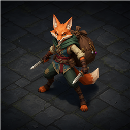

`hero_thief.png`

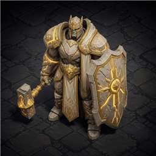

`hero_paladin.png`

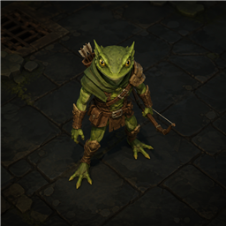

`hero_ranger.png`

## Props

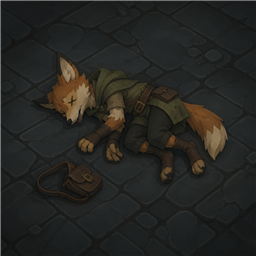

`prop_corpse.png`

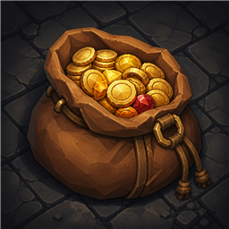

`prop_loot.png`

## Unused per-tile stamps (game uses wraps instead)

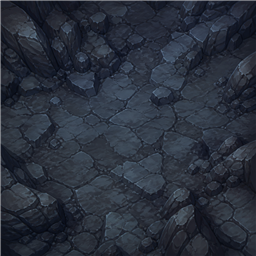

`tile_rock.png`

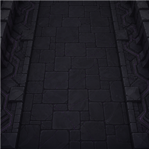

`tile_floor.png`
